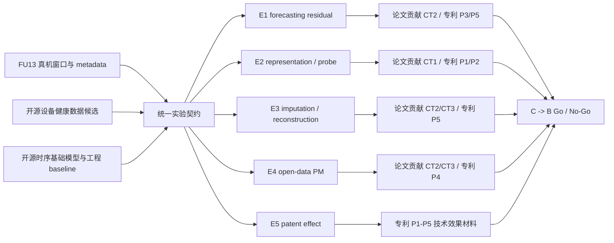

# C 阶段最小证据实验设计

## 元信息

- 日期：2026-06-04
- 阶段：C 阶段规划前置规格
- 状态：待规格审查与用户确认
- 主线优先级：论文/专利知识成果优先，工程化产品承接
- 关联文档：
  - `docs/research/source-registry.md`
  - `docs/research/paper-patent-directions.md`
  - `docs/research/task-metric-matrix.md`
  - `docs/research/open-source-model-paper-matrix.md`
  - `docs/research/predictive-maintenance-dataset-matrix.md`
  - `docs/research/foundation-model-training-route.md`
  - `docs/research/project-mainline-refactor-blueprint.md`

## 背景

B08 当前已经完成 A 阶段的主线收敛：短期第一目标是形成论文、专利和学术综述等知识成果；第二目标是沉淀统一数据语料、开源模型适配、训练评测 workflow 和可复现模型研发工作台。

下一阶段不应直接跳入大规模自研训练，也不应把开源模型跑分包装成预测性维护产品能力。C 阶段的第一步应是建立最小证据实验：用 FU13 真机数据和可核对的开源预测性维护数据，把 `E1-E5` 证据需求转化为可运行、可失败、可复核、可服务论文/专利主线的实验契约。

本规格定义 C 阶段最小证据实验设计，不是执行计划，不直接修改源码、配置、数据或测试。

## 目标

本阶段目标是设计一组最小实验包，使项目能够回答以下问题：

1. FU13 真机数据是否能够稳定支撑 forecasting residual、imputation / reconstruction 和 representation probe 三类无标签或弱标签证据。
2. 主流开源时序基础模型是否能够在统一窗口、统一 split、统一指标和统一报告模板下形成可比较结果。
3. C-MAPSS、IMS Bearing、PRONOSTIA / FEMTO-ST、Tennessee Eastman Process 等公开数据是否能够补足 FU13 暂缺的故障、退化、RUL 或过程异常证据。
4. 五个专利候选方向 `P1-P5` 是否能够获得最小技术效果样例、对照表或风险清单。
5. 现有开源模型和工程 baseline 是否已经足够，或者是否存在进入 B 阶段最小自研原型的必要缺口。

## 非目标

本阶段明确不做以下事情：

1. 不启动 B 阶段自研基础模型训练。
2. 不宣称已经形成生产告警、RUL 精确估计、自动维修建议或预测性维护闭环。
3. 不发布 FU13 原始数据、开源 benchmark 或模型权重。
4. 不默认下载、清洗或使用任何许可证尚未核对的外部数据。
5. 不进行泛化代码重构；只有执行计划证明现有代码阻碍最小证据实验时，才另开 code-refactor spec。
6. 不做专利新颖性、创造性、可授权性或侵权风险法律判断。

## 设计原则

1. 论文/专利主线优先：每个实验必须挂接到 `CT1-CT4`、`E1-E5` 或 `P1-P5`，不能只因为模型热门而进入实验。
2. FU13 真实场景优先：最先验证真实设备 pipeline 和弱标签任务；公开数据只补充 FU13 当前缺少的第三层证据。
3. 最小闭环优先：先完成少量可复核实验包，再扩展模型、数据和任务。
4. 强基线优先：复杂模型必须和工程 baseline、forecasting-first baseline 比较，避免把模型复杂度当作贡献。
5. 失败可记录：模型跑不通、许可证不清、字段无法映射、指标不稳定，都是有效结果，必须沉淀为 No-Go 证据。
6. 禁止过度解释：所有报告必须显式写出 invalid claims，防止残差、重建误差或弱标签 probe 被解释为生产能力。

## 总体方案

C 阶段最小证据实验采用“实验契约 -> 证据包 -> 主线映射 -> 决策门”的结构。

该结构的关键点是：C 阶段不是追求一次性覆盖所有模型和所有数据，而是先定义统一契约，使每个实验结果都能被追溯到论文贡献、专利候选和后续工程承接。

## 实验契约

每个 C 阶段候选实验必须在执行前写清楚以下字段：

| 字段 | 要求 |
| --- | --- |
| `experiment_id` | 唯一实验编号，例如 `c0_fu13_ttm_forecast_residual_v1` |
| `evidence_id` | 必须挂接 `E1-E5` 之一 |
| `paper_contribution_id` | 挂接 `CT1-CT4`，若不支撑论文主线则说明原因 |
| `patent_id` | 若支撑专利，挂接 `P1-P5`；否则写 `none` |
| `dataset` | 数据来源、版本、许可状态、映射状态和 split policy |
| `task_id` | 对应 `task-metric-matrix.md` 中的任务层级 |
| `model_or_baseline` | 开源模型、工程 baseline 或失败原因 |
| `input_contract` | 窗口长度、变量组织、metadata 使用口径、输入排除口径 |
| `primary_metric` | 预先指定主指标，不允许结果后调整 |
| `comparison` | 至少一个强基线或明确不可比较原因 |
| `valid_when` | 结果成立条件 |
| `no_go_when` | 失败或不进入下一阶段条件 |
| `artifact_output` | 指标表、样例表、失败记录、复核清单或技术效果表 |
| `invalid_claims` | 禁止解释，例如生产告警、FU13 RUL、自动维修建议 |

## 数据设计

### FU13 最小数据契约

FU13 是 C 阶段第一入口，优先用于真实 pipeline 和第一、第二层任务验证。最小数据契约应覆盖：

| 字段族 | 最小要求 | 用途 |
| --- | --- | --- |
| 时间与窗口 | `timestamp`、窗口长度、horizon、采样间隔、缺失规则 | forecasting、imputation、representation |
| 设备与运行 | `device_id`、`batch_id/run_id/cycle_id`、切分策略 | 防止泄漏，支持跨 run 或时间切分 |
| 传感器 | `sensor_id`、单位、物理域或子系统分组 | 支撑多传感器、跨传感器、P1/P5 |
| 阶段与质量 | `stage`、`quality_flag`、字段来源、是否作为输入 | 支撑弱标签 probe，并避免输入泄漏 |
| 弱标签代理 | `failure_proxy`、残差 top-k 规则、专家复核入口 | 支撑异常候选信号，不等于生产告警 |
| 来源与边界 | 来源说明、内部使用边界、再分发边界、数据版本 | 支撑论文/专利材料的证据可追溯性 |

如果某字段暂缺，不应制造伪标签；应在数据映射报告中标记为 `unknown` 或 `not_available`，并记录对实验的影响。

### 开源数据最小核对契约

公开数据进入实验前必须完成轻量核对：

| 数据集 | 目标任务 | 最小核对项 | 允许支撑 | 禁止外推 |
| --- | --- | --- | --- | --- |
| C-MAPSS | RUL / run-to-failure | 官方来源、引用要求、RUL 构造、按 unit 切分 | 开源退化/RUL 验证路径 | FU13 已具备 RUL 能力 |
| IMS Bearing | 轴承退化 / 故障过程 | 官方来源、标签语义、run 切分、退化阶段 | 轴承设备健康与异常候选验证 | FU13 故障诊断能力 |
| PRONOSTIA / FEMTO-ST | 轴承加速退化 / RUL | 下载入口、许可证、RUL 构造、工况切分 | 小样本 RUL 与退化趋势验证 | 生产维护提前量 |
| Tennessee Eastman Process | 过程异常 / 故障分类 | 数据版本、故障定义、评测协议、许可证 | 多变量过程异常和分类验证 | 设备 RUL 或自动维修 |

公开数据的角色是补充验证和方法对照，不替代 FU13 的现场语义。

## 模型与 baseline 设计

C 阶段模型对照分三层：

| 层级 | 候选 | 首要用途 | 最小要求 |
| --- | --- | --- | --- |
| 工程 baseline | rolling / seasonal naive、robust baseline、简单补全、变点检测 | 下限对照和失败解释 | 必须至少覆盖 forecasting 或 reconstruction 的一个任务 |
| forecasting-first TSFM | TTM、Chronos、TimesFM、Moirai / Uni2TS | 正常轨迹预测、概率预测、残差候选信号 | 优先保留 TTM，其他模型按可运行性逐步补充 |
| multi-task / representation TSFM | MOMENT、UniTS，TSPulse 作为扩展候选 | embedding、imputation、classification、anomaly 任务接口 | 先验证 representation / imputation，再考虑更复杂任务 |

模型无法运行时，应记录原因：输入形式不匹配、变量数限制、任务头缺失、依赖冲突、许可证不清、权重不可用或资源成本不合适。失败记录同样支撑论文 related-work 缺口和工程承接判断。

## 最小证据包

### E1：forecasting residual 证据包

目的：验证 FU13 上 forecasting-first 基线是否能产生稳定预测误差和残差候选信号。

| 项目 | 设计 |
| --- | --- |
| 首选数据 | FU13 对齐后的多传感器窗口 |
| 候选模型 | 工程 forecasting baseline、TTM，后续补 Chronos / TimesFM / Moirai |
| 任务 | next-window forecasting 或短 horizon forecasting |
| 主指标 | MAE / RMSE，必要时补 coverage |
| 产物 | 指标表、变量级误差排序、残差分布、top-k 残差候选样例、失败案例 |
| 支撑 | `CT2_layered_validation`、`P3_weak_label_anomaly_signal`、`P5_multitask_health_evaluation` |
| 无效解释 | 不得解释为生产告警、FU13 RUL、自动维修或专利授权结论 |

Go 条件：同一 split 下至少形成工程 baseline 与一个 forecasting-first 模型的可比较结果，并能输出残差候选样例。

No-Go 条件：窗口或 split 无法定义、目标变量不稳定、baseline 不可复现、残差无法追溯到变量/时间/阶段。

### E2：representation / probe 证据包

目的：验证通用时序表征是否能在 FU13 的阶段、质量标记或弱标签 proxy 上形成可解释结构。

| 项目 | 设计 |
| --- | --- |
| 首选数据 | FU13 时序窗口、阶段 metadata、传感器物理域字典、可用弱标签 proxy |
| 候选模型 | MOMENT、UniTS，必要时用 TTM embedding 或简单统计 embedding 做对照 |
| 任务 | frozen embedding + linear probe、clustering、跨阶段稳定性分析 |
| 主指标 | probe macro F1、clustering score、跨阶段稳定性 |
| 产物 | 表征 probe 报告、可视化样例、输入排除说明、metadata 缺口 |
| 支撑 | `CT1_problem_definition`、`P1_stage_sensor_encoding`、`P2_small_sample_pretraining` |
| 无效解释 | 不得解释为真实健康等级、生产告警、自动维修或模型理解全部业务语义 |

Go 条件：明确 stage/quality/failure proxy 是否进入输入；probe 标签与 embedding 训练隔离；至少形成一个强基线对照。

No-Go 条件：标签直接泄漏到输入、切分导致同批次泄漏、类别极端不均衡且无解释、probe 结果无法复现。

### E3：imputation / reconstruction 证据包

目的：验证模型是否能恢复被遮蔽的多传感器窗口，并观察变量级重建误差是否能作为设备状态分析线索。

| 项目 | 设计 |
| --- | --- |
| 首选数据 | FU13 多变量窗口和变量分组 |
| 候选模型 | 简单补全 baseline、MOMENT、UniTS，必要时补 TSPulse |
| 任务 | masked sensor reconstruction、cross-sensor imputation |
| 主指标 | reconstruction MAE / RMSE、mask ratio sensitivity |
| 产物 | 插补指标表、变量级重建误差、mask 策略说明、失败样例 |
| 支撑 | `CT2_layered_validation`、`CT3_unified_schema_metric`、`P5_multitask_health_evaluation` |
| 无效解释 | 不得解释为异常识别、生产告警、RUL 或维修建议 |

Go 条件：mask 策略、可见上下文、被遮蔽变量和 split policy 在评测前固定。

No-Go 条件：mask 后任务过易或过难、评测窗口与训练窗口泄漏、缺失规则与真实缺失语义混淆。

### E4：open-data PM 证据包

目的：用公开预测性维护数据补足 FU13 暂缺的故障、退化、RUL 或过程异常证据。

| 项目 | 设计 |
| --- | --- |
| 首选数据 | C-MAPSS、IMS Bearing、PRONOSTIA / FEMTO-ST、Tennessee Eastman Process |
| 候选模型 | 与 E1-E3 尽量共享 adapter 的工程 baseline 和开源模型 |
| 任务 | RUL、fault classification、degradation trend、process anomaly |
| 主指标 | 数据集特定指标，如 RUL MAE / RMSE、macro F1、AUROC、trend correlation |
| 产物 | 数据任务映射、许可证核对表、baseline 结果、与 FU13 差异说明 |
| 支撑 | `CT2_layered_validation`、`CT3_unified_schema_metric`、`P4_real_open_data_fusion` |
| 无效解释 | 不得解释为 FU13 已有同等标签、生产级 RUL 或自动维修能力 |

Go 条件：至少一个公开数据集完成来源、许可、标签语义、split policy 和任务指标核对。

No-Go 条件：许可证或用途边界不清、下载入口不可靠、标签语义无法解释、公开数据任务与 B08 主线偏离。

### E5：patent effect 证据包

目的：为五个专利候选方向形成最小技术效果样例、对照表和风险清单。

| 专利候选 | 最小技术效果样例 |
| --- | --- |
| `P1_stage_sensor_encoding` | 对比有/无阶段与传感器物理域编码时的 representation probe 或残差分组差异 |
| `P2_small_sample_pretraining` | 对比 zero-shot、frozen probe、few-shot adapter 或少量 fine-tuning 的小样本差异 |
| `P3_weak_label_anomaly_signal` | 对比 forecasting residual、imputation error、弱标签 proxy 和专家复核队列 |
| `P4_real_open_data_fusion` | 对比 FU13 schema 与公开数据 schema / task / metric 映射后的互补证据 |
| `P5_multitask_health_evaluation` | 对比单一 forecasting 指标与 residual、reconstruction、probe、open-data PM 的多任务评估表 |

E5 的产物不是专利结论，而是代理人沟通和技术交底前的证据材料。每个样例都必须附带 prior-art 风险入口和 invalid claims。

## 工程承接边界

C 阶段后续执行可以沉淀工程资产，但必须保持非默认、可追溯、可失败：

1. 统一实验配置：固定 `experiment_id`、数据、任务、模型、指标、seed、split 和 gate。
2. adapter contract：为工程 baseline、TTM、MOMENT / UniTS 和后续模型提供统一输入输出。
3. 报告模板：输出指标、失败原因、样例、复核入口、invalid claims 和 Go / No-Go。
4. 数据映射记录：记录来源、许可、字段映射、标签置信度和 split policy。
5. 缓存边界：数据、模型权重和本机报告不进入默认提交路径。

如果现有 `src/b08_model_core`、`configs`、`tests` 或 `reports` 阻碍上述最小闭环，应另开“主线必要代码重构”规格和计划，不能在本 spec 中直接扩大范围。

## Go / No-Go 决策

C 阶段最小证据实验完成后，应形成 C -> B 决策表。

| 决策 | 条件 |
| --- | --- |
| Go to B minimal prototype | 开源模型和工程 baseline 在 representation / imputation / weak-label 任务上存在稳定缺口，且结构感知输入、阶段编码、多任务头或弱标签目标有明确实验必要性 |
| Stay in C adaptation | 开源模型可覆盖主要任务，但 adapter、数据映射、报告和复核流程仍需补齐 |
| Knowledge-only consolidation | 实验结果足以支撑框架论文、专利背景和路线判断，但不足以支撑方法创新或自研训练 |
| No-Go / hold | 数据许可、标签语义、split policy、模型可运行性或复核条件不足，继续扩大实验会制造伪证据 |

任何 Go 决策都必须预先指定主任务、强基线、最低增益、多 seed 或置信区间口径，以及失败条件。不得后验挑选表现好的任务来支持自研训练。

## 验收标准

本规格完成后，后续执行计划应能直接拆分出以下可验证任务：

1. C0 数据与标签核对任务：FU13 字段、公开数据来源、许可、schema 和 split policy。
2. C0 实验契约任务：统一 `experiment_id`、task、metric、baseline、artifact 和 invalid claims。
3. C0 FU13 最小闭环任务：E1、E2、E3 至少各有一个候选实验定义。
4. C0 公开数据补证任务：E4 至少选择一个公开数据集进入轻量核对，不默认训练。
5. C0 专利效果样例任务：E5 能映射到 `P1-P5` 的最小样例或风险表。
6. C0 报告模板任务：能够产出论文/专利主线可引用的证据包，而不是零散实验日志。
7. C -> B 决策任务：形成 Go / Stay / Knowledge-only / No-Go 的阶段判断。

若执行计划无法从本规格拆出上述任务，说明规格仍然过宽、过虚或主线映射不足，需要回到本文件修订。

## 风险

1. 数据许可风险：公开数据可能无法直接用于训练、再分发或产品材料，必须先核对。
2. 标签语义风险：FU13 弱标签和公开数据标签不能混为真实故障标签。
3. 输入泄漏风险：stage、quality_flag 或 failure proxy 如果进入输入，probe 结果不能解释为模型自主学习能力。
4. 指标漂移风险：若结果后调整 horizon、top-k、mask ratio 或主指标，会削弱论文和专利证据可信度。
5. 模型依赖风险：部分开源模型接口、权重、许可证或资源成本可能不适合 B08，失败需记录。
6. 主线偏移风险：若 C 阶段只追求模型跑分，会偏离论文/专利主线和真实 FU13 场景。
7. 过度承诺风险：残差、重建误差、embedding 聚类或公开 RUL 结果都不能写成生产预测性维护能力。

## 后续计划入口

用户确认本规格后，下一步应进入 `writing-plans` 阶段，形成：

`docs/superpowers/plans/2026-06-04-c-stage-minimum-evidence-plan.md`

该计划应按 `E1-E5` 和工程承接边界拆分为可执行任务，并明确哪些任务只是文档/契约准备，哪些任务需要代码、数据、配置或报告模板变更。
