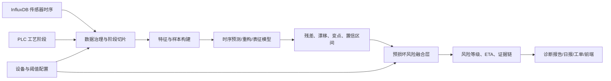

# B08 设备时序基础模型总体规划建设方案

版本：v0.1  
日期：2026-05-30  
定位：设备预测性维护项目的内部算法底座

## 1. 核心结论

B08 的建设目标应从“提前预测设备是否要损坏”出发，而不是从“做一个通用时序大模型”出发。模型底座的价值在于让预测性维护项目能够在真实设备数据上跑起来，持续输出：

- 未来一段时间内的设备或子系统损坏风险。
- 风险提前量、ETA 或剩余安全运行窗口。
- 支撑判断的传感器、工艺阶段、趋势、残差和物理阈值证据。
- 可供上层诊断、日报、工单和维护建议模块消费的结构化结果。

因此，B08 应定位为：

> 面向预测性维护交付的设备时序预测与预损坏风险推演模型底座。

它的直接用户是内部算法研发和应用研发人员；现场运维人员、管理层和前端大屏是上层预测性维护系统的最终用户。

## 2. 问题重新定义

预测性维护项目的最终问题是：设备是否会在未来一段时间内发生损坏、性能失效、停机风险或需要维护的劣化事件。

但当前客观条件决定了模型不能一开始就直接学习“故障分类器”：

- 初期没有故障标签，不能训练传统监督分类模型。
- 单台设备只有 1-2 个月数据，故障样本更少。
- 采样存在停机间隔，不能假设稳定周期。
- 工艺阶段强相关，同一传感器在不同阶段含义不同。
- 多物理域耦合，单点异常不等于设备损坏。

所以需要把“预测损坏”拆成可研发、可验证、可交付的中间能力：

1. 预测正常运行下传感器未来轨迹或分布。
2. 识别当前观测是否偏离正常可解释范围。
3. 判断偏离是否持续、扩大、跨传感器共振或接近物理危险边界。
4. 将上述证据融合为未来窗口内的损坏风险、ETA 和维护优先级。
5. 随着故障、维修、停机和专家复核数据积累，将风险模型校准为更接近真实故障概率和 RUL 的模型。

## 3. 总体目标

在预测性维护项目中形成一个可被研发团队调用的设备时序模型底座，使系统能够基于真空速凝炉等设备的真实传感器数据，提前输出设备或关键子系统的损坏风险、预计风险窗口和解释证据。

目标不应写成“做一个基础大模型”，而应写成“支撑预测性维护交付的模型能力闭环”。

## 4. 建设原则

### 4.1 以损坏预测为终点

异常检测、趋势分析、预测残差和健康画像都只是证据，不是最终目标。最终输出必须能回答：

- 未来一个炉次、未来 24 小时或未来 7 天是否存在损坏风险。
- 风险来自哪个子系统或传感器组合。
- 当前还有多少安全运行余量。
- 应继续生产、监控运行、计划维护还是立即处理。

### 4.2 先做预损坏风险，再做真实故障概率

在无故障标签阶段，系统先输出“预损坏风险评分”。这个评分不是严格统计意义上的真实故障概率，而是由残差、趋势、变点、阈值距离和物理规则融合得到的风险信号。

当后续积累到故障记录、维修记录、停机记录和专家复核结果后，再逐步校准为：

- 指定时间窗口内的故障概率。
- 指定部件或子系统的 RUL。
- 维护动作后的风险回落效果。

### 4.3 模型与规则协同

神经网络模型负责学习复杂时序模式、预测未来轨迹、生成状态表征；规则和统计层负责可解释性、物理安全约束、阈值映射和交付稳定性。

项目初期不建议做纯端到端黑箱故障预测模型。

## 5. 总体架构

## 6. 能力分层

### 6.1 数据层

负责把原始采集数据转成模型可用数据集：

- 统一设备、传感器、物理域和工艺阶段定义。
- 处理非均匀采样、停机间隔、缺失值和异常尖点。
- 构造按炉次、按阶段、按时间窗口的训练样本。
- 记录每个样本的设备、阶段、传感器、物理阈值和数据质量标签。

### 6.2 模型层

负责输出可用于损坏预测的中间信号：

- 短期预测：未来 5 分钟、30 分钟、1 个阶段或 1 个炉次内的传感器轨迹。
- 概率预测：均值、分位数、置信区间。
- 重构误差：当前窗口是否不像正常运行状态。
- 状态表征：设备、子系统、阶段窗口的 embedding。
- 趋势与变点：识别慢性劣化和突发状态变化。

### 6.3 风险推演层

负责把模型信号转成面向预测性维护的输出：

- 未来窗口内的损坏风险评分。
- 风险等级：NORMAL、WATCH、WARNING、ALERT。
- ETA：若当前趋势持续，预计多久到达危险阈值或不可生产状态。
- 风险来源：传感器、阶段、子系统、物理域。
- 证据链：残差、漂移、斜率、变点、阈值距离、跨传感器一致性。

### 6.4 应用接口层

负责向预测性维护系统提供结构化结果：

- 传感器级风险记录。
- 子系统级风险汇总。
- 设备级健康和损坏风险摘要。
- 图表数据和报告 JSON。
- 可供 LLM 转写的结构化诊断要点。

## 7. 技术路线

### 路线 A：预测残差主线

使用时序基础模型或轻量模型预测正常情况下的未来传感器轨迹，再用实际值与预测分布的偏差作为风险证据。

适用场景：

- 泵振动、压力、氧浓度、温度等连续传感器。
- 需要提前发现偏离趋势。
- 需要输出置信区间和 ETA。

### 路线 B：阶段化正常行为建模

按工艺阶段建立正常基线，判断同一设备、同一传感器、同一阶段下是否出现异常模式。

适用场景：

- 抽真空阶段氧浓度异常。
- 冷却阶段温度下降曲线异常。
- 浇筑或溶解阶段压力、电流、流量协同异常。

### 路线 C：多证据风险融合

将预测残差、趋势漂移、变点、物理阈值距离、跨传感器一致性和知识库规则融合为损坏风险。

适用场景：

- 单个传感器不足以判断损坏。
- 需要按机械、液压、热、气氛、电气、流体子系统汇总风险。
- 需要给出维护优先级。

推荐组合为：A 作为模型核心，B 作为上下文约束，C 作为项目交付出口。

## 8. 阶段规划

### 8.1 想法阶段

目标是证明课题值得独立建设为内部模型底座。

最低证据：

- 明确用户为内部研发人员。
- 明确最终服务于设备预测性维护交付。
- 明确模型不直接替代应用系统，而是输出预测、残差、风险和证据。
- 完成 PEA 初稿、技术路线和 MVP 范围。

### 8.2 MVP 阶段

目标是证明核心假设成立：在真实或半真实设备数据上，模型底座能提前发现损坏风险信号，并输出研发可用的结构化结果。

建议范围：

- 设备：先选真空速凝炉 1-3 台。
- 子系统：优先选择泵振动、液压压力、冷却温度/流量、氧浓度、泄漏电流。
- 时间窗口：最近数小时实时风险 + 最近 1 个月趋势推演。
- 输出：传感器级风险、子系统级风险、ETA、证据链。

### 8.3 发布阶段

目标是进入预测性维护项目交付能力。

最低证据：

- 稳定的批处理或准实时推理服务。
- 与 InfluxDB、管理后台、前端图表的数据接口跑通。
- 有验收指标、运维边界、模型版本和数据版本记录。
- 有至少一轮现场用户或项目团队复核。

### 8.4 规模化阶段

目标是从单类设备扩展到工站设备、机器人和产线关键设备。

最低证据：

- 标准化数据接口。
- 可复用的传感器/阶段/物理域配置方式。
- 可迁移模型或适配器机制。
- 多项目样板和可度量的维护价值证据。

## 9. 关键风险与应对

| 风险 | 表现 | 应对 |
| --- | --- | --- |
| 无故障标签 | 无法验证真实故障预测能力 | 先做预损坏风险，结合专家复核、物理阈值事件、维修记录和在线影子运行逐步校准 |
| 小样本 | 深度模型容易过拟合 | 使用预训练时序模型、轻量微调、阶段化基线和稳健统计 |
| 工艺阶段混杂 | 同一传感器不同阶段含义不同 | 阶段 token、阶段切片、阶段内单独建模 |
| 误报影响交付 | 报警太多导致现场不信任 | 风险等级分层、持续性判断、跨传感器一致性、共形校准 |
| 黑箱不可解释 | 现场无法接受 | 输出证据链，不只输出分数 |
| 泛化过早 | 跨设备追求太高导致 MVP 失败 | 先单设备或少量设备跑通，再做迁移 |

## 10. 近期建议

短期不要把工作重心放在自研大模型训练上，而应优先建设以下资产：

1. 设备时序数据集构建规范。
2. 工艺阶段切片和样本生成工具。
3. 预测残差与风险融合的基线系统。
4. 开源时序基础模型的离线评测脚本。
5. 预损坏风险输出 JSON Schema。
6. 面向项目交付的 MVP 验收指标。

这条路线能保证 B08 与预测性维护项目的最终目标一致，同时降低无标签、小数据阶段的研发风险。
